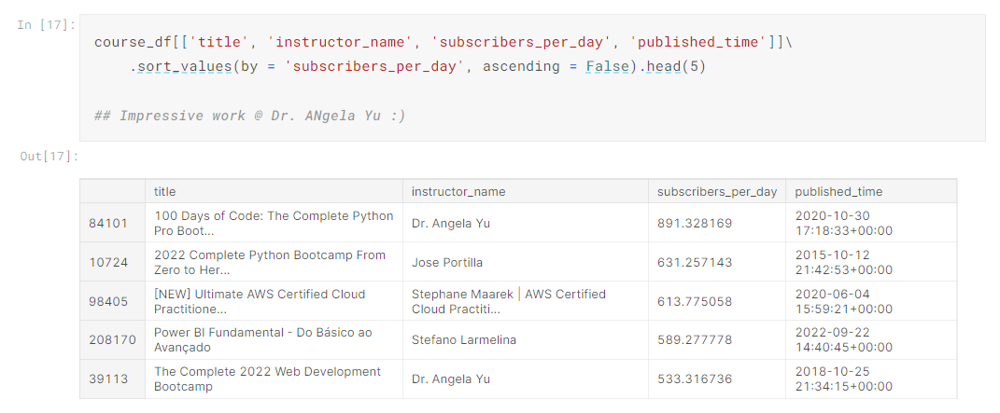

# My Kaggle Notebooks

All of the notebooks can be found [here](https://www.kaggle.com/wolfsdata/code), at my Kaggle profile.

## 1. [Exploring Udemy Courses](https://www.kaggle.com/code/wolfsdata/udemy-courses-exploration/notebook?scriptVersionId=113207896) with Python, on Kaggle

**Skills this project showcases:**
- Working with **Pandas DataFrames**
- Working with **datetime objects**
- Plotting with **Seaborn**
- **Conditional string formatting** in Python
- Using **if/else** statements and for loops
- My **thinking process** when facing a novel dataset
- **Most importantly:** Asking interesting and valuable questions and using data to answer them :)

---

## 2. [Exploring a dataset on layoffs 2020 - 2022](https://www.kaggle.com/code/wolfsdata/layoffs-worldwide-2020-2022/notebook?scriptVersionId=113375157) with Python, on Kaggle

**Skills showcased:**
- Data manipulation with **Pandas**
- Working with **dictionaries**
- Writing **functions**
- Data visualization with **plotly.express**
- Working with **dates**
- **Merging (joining) data frames** in Pandas on multiple columns, and taking care of the necessary preconditions for a successful join

**New useful things I've learned:**
- Using "pd.groupby()" method + ".size()" :)
- Creating simple animations with **plotly.express**
- Creating geographical scatter plots with **px.scatter_geo**
- What **fuzzy matching** is, how to apply it & why it doesn't suit my needs for this project :)

---

## 3. [Cellphone price prediction - Decision Trees and Random Forests](https://www.kaggle.com/code/wolfsdata/price-classification-trees-and-forests/notebook) with Python & Scikit-learn

**Skills showcased:**
- Data Visualization (correlation heatmaps) with **plotly**
- Data Wrangling with **Pandas**
- Feature selection with **Backward Elimination**
- **Feature scaling**
- Using Scikit-learn's **Decision Trees** and **Random Forests** and optimizing them :)
